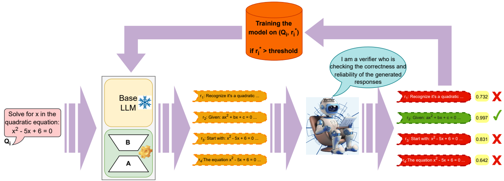
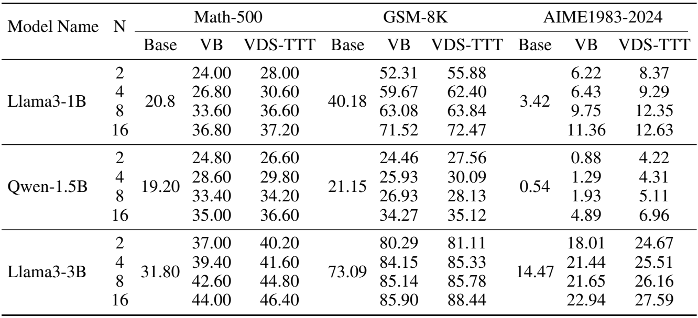
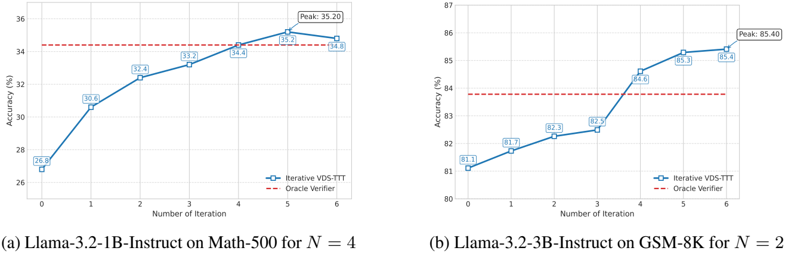

# 🚀 Continuous Self-Improvement of Large Language Models by Test-time Training with Verifier-Driven Sample Selection

The code of our paper "Continuous Self-Improvement of Large Language Models by Test-time Training with Verifier-Driven Sample Selection"

## Overview
Learning to adapt pretrained language models to unlabeled, out‑of‑distribution data is a critical challenge, as models often falter on structurally novel reasoning tasks even while excelling within their training distribution. We introduce a new framework called VDS-TTT - Verifier‑Driven Sample Selection for Test‑Time Training to efficiently address this. We use a learned verifier to score a pool of generated responses and select only from high ranking pseudo‑labeled examples for fine-tuned adaptation. Specifically, for each input query our LLM generates $N$ candidate answers; the verifier assigns a reliability score to each, and the response with the highest confidence and above a fixed threshold is paired with its query for test‑time training. We fine‑tune only low‑rank LoRA adapter parameters, ensuring adaptation efficiency and fast convergence. Our proposed self-supervised framework is the first to synthesize verifier driven test-time training data for continuous self-improvement of the model. Experiments across three diverse benchmarks and three state‑of‑the‑art LLMs demonstrate that VDS‑TTT yields up to a 32.29% relative improvement over the base model and a 6.66% gain compared to verifier-based methods without test‑time training, highlighting its effectiveness and efficiency for on‑the‑fly large language model adaptation.

## Results
The following table reports exact‑match accuracy for our three baselines—Llama‑3.2‑1B‑Instruct, Llama‑3.2‑3B‑Instruct, and DeepSeek‑R1‑Distill‑Qwen‑1.5B—on GSM8K, Math‑500, and AIME1983–2024 using $N=2, 4, 8, 16$ candidate responses. For each $N$, we compare three settings: (1) Base: the frozen model without any Test Time Training; (2) VB (Verifier-Based): where we generate $N$ samples and select the single highest‑scoring response via our verifier; and (3) VDS‑TTT: which fine‑tunes LoRA adapters on all verifier‑selected, high‑confidence pseudo‑labels. 

This Figure illustrates the performance trajectory of the iterative VDS-TTT strategy, where the VDS-TTT procedure is applied multiple iterations to the same model. In this figure, the x-axis denotes the number of iterations (i.e., how many times VDS-TTT has been applied). This iterative process reveals a clear trend: model performance consistently improves with successive iterations—up to a certain point. However, due to inherent model capacity limitations, this iterative improvement eventually exhibits diminishing returns. That is why performance plateaus beyond a certain point, additional iterations result in minor fluctuations rather than continued gains. 

